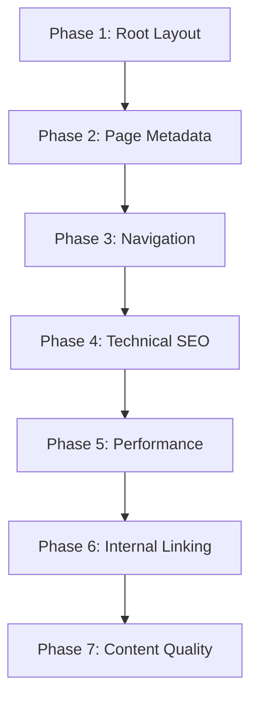

# ToolZoneX - Complete SEO Optimization Plan

## Project Overview
- **Site Name**: ToolZoneX
- **Current URL**: https://punit461.github.io/toolzonex/
- **Framework**: Next.js 14+ with App Router
- **Deployment**: GitHub Pages (static export)

## Current SEO Status
| Element | Status | Notes |
|---------|--------|-------|
| Root metadata | ✅ Basic | Title + description only |
| Page metadata | ⚠️ Partial | Some pages have basic metadata |
| Open Graph | ❌ Missing | No OG tags |
| Twitter Cards | ❌ Missing | No Twitter meta |
| JSON-LD Schema | ❌ Missing | No structured data |
| Sitemap | ⚠️ Basic | Needs updating |
| robots.txt | ⚠️ Basic | Needs enhancement |
| Canonical URLs | ⚠️ Partial | Some pages have them |
| Breadcrumbs | ❌ Missing | No breadcrumb navigation |
| Performance | ⚠️ Needs review | next/image not optimized |

---

## Phase 1: Core Metadata & Structured Data

### 1.1 Root Layout Enhancement ([`src/app/layout.tsx`](src/app/layout.tsx))
**Goal**: Add comprehensive metadata with Open Graph, Twitter Cards, and WebSite schema

**Changes**:
```typescript
export const metadata: Metadata = {
  title: {
    default: "ToolZoneX — Smart Tools for Every Decision",
    template: "%s | ToolZoneX",
  },
  description: "Free online calculators for Finance, Health, and Utilities — EMI, SIP, Income Tax, BMI, Gold Rate, PPF, GST and more. Instant, accurate results.",
  keywords: ["online calculator", "free calculator", "EMI calculator", "SIP calculator", "income tax calculator", "BMI calculator", "PPF calculator", "GST calculator", "India finance tools"],
  authors: [{ name: "ToolZoneX" }],
  creator: "ToolZoneX",
  publisher: "ToolZoneX",
  metadataBase: new URL(process.env.NEXT_PUBLIC_SITE_URL || 'https://punit461.github.io/toolzonex/'),
  alternates: {
    canonical: '/',
    languages: { 'en-US': '/en-US' },
  },
  openGraph: {
    type: "website",
    locale: "en_US",
    url: "/",
    siteName: "ToolZoneX",
    title: "ToolZoneX — Smart Tools for Every Decision",
    description: "Free online calculators for Finance, Health, and Utilities. EMI, SIP, Income Tax, BMI, Gold Rate, PPF, GST and more.",
    images: [{ url: "/toolzonex/og-image.png", width: 1200, height: 630, alt: "ToolZoneX - Free Online Calculators" }],
  },
  twitter: {
    card: "summary_large_image",
    title: "ToolZoneX — Smart Tools for Every Decision",
    description: "Free online calculators for Finance, Health, and Utilities.",
    images: ["/toolzonex/og-image.png"],
    creator: "@toolzonex",
  },
  robots: {
    index: true,
    follow: true,
    googleBot: { index: true, follow: true, "max-video-preview": -1, "max-image-preview": "large", "max-snippet": -1 },
  },
};
```

**JSON-LD WebSite Schema** (in body):
```json
{
  "@context": "https://schema.org",
  "@type": "WebSite",
  "name": "ToolZoneX",
  "url": "https://punit461.github.io/toolzonex/",
  "description": "Free online calculators for Finance, Health, and Utilities",
  "potentialAction": {
    "@type": "SearchAction",
    "target": "https://punit461.github.io/toolzonex/?q={search_term_string}",
    "query-input": "required name=search_term_string"
  }
}
```

### 1.2 Add viewport and theme-color meta tags
Add to root layout's `<head>`:
- `viewport` meta tag (already handled by Next.js)
- `theme-color` for mobile browser chrome
- `apple-mobile-web-app-capable` and `apple-mobile-web-app-status-bar-style`

---

## Phase 2: Page-Specific Metadata

### 2.1 Finance Calculator Pages (13 pages)
**Location**: [`src/app/finance/*/page.tsx`](src/app/finance)

| Page | Title | Description |
|------|-------|-------------|
| emi-calculator | EMI Calculator - Calculate Home, Car & Personal Loan EMI | Free online EMI calculator to calculate monthly installments for home, car, and personal loans with detailed amortization schedule. |
| sip-calculator | SIP Calculator - Estimate Mutual Fund Returns | Calculate expected returns on your SIP investments with our free SIP calculator. Plan your mutual fund investments for wealth creation. |
| gst-calculator | GST Calculator - Add or Remove GST from Amount | Easy GST calculator to add or remove GST from any amount. Calculate inclusive and exclusive prices instantly. |
| income-tax-calculator | Income Tax Calculator - Old vs New Tax Regime | Compare tax liability under old and new tax regimes. Calculate income tax for FY 2025-26 with latest slabs. |
| ppf-calculator | PPF Calculator - Public Provident Fund Returns | Calculate PPF maturity amount and interest earned. Plan your PPF investments for tax-free returns. |
| rent-vs-buy-calculator | Rent vs Buy Calculator - Make Smart Property Decisions | Compare renting vs buying a home with this comprehensive calculator. Make informed property decisions. |
| gold-calculator | Gold Rate Calculator - Gold Price with Making Charges | Calculate gold price including making charges and GST. Compare 24K, 22K, and 18K gold rates. |
| silver-calculator | Silver Rate Calculator - Silver Price with Making Charges | Calculate silver price including making charges and GST. Get accurate silver rate calculations. |
| ssy-calculator | SSY Calculator - Sukanya Samriddhi Yojana Returns | Calculate Sukanya Samriddhi Yojana maturity amount. Plan for your daughter's education. |
| salary-increment-calculator | Salary Increment Calculator - CTC & Take-Home Calculator | Calculate your new salary after increment. Understand how CTC changes affect your in-hand salary. |
| retirement-calculator | Retirement Calculator - Plan Your Retirement Corpus | Calculate retirement corpus needed and monthly SIP required. Plan for a secure retirement. |
| gratuity-calculator | Gratuity Calculator - Calculate Gratuity Amount | Calculate gratuity amount for employees. Understand your end-of-service benefits. |

**JSON-LD WebApplication Schema** for each:
```json
{
  "@context": "https://schema.org",
  "@type": "WebApplication",
  "name": "EMI Calculator",
  "description": "Calculate your monthly EMI for home, car, or personal loans.",
  "url": "https://punit461.github.io/toolzonex/finance/emi-calculator",
  "applicationCategory": "FinanceApplication",
  "operatingSystem": "Web Browser",
  "offers": { "@type": "Offer", "price": "0", "priceCurrency": "INR" }
}
```

### 2.2 Health Calculator Pages (5 pages)
**Location**: [`src/app/health/*/page.tsx`](src/app/health)

| Page | Title | Description |
|------|-------|-------------|
| bmi-calculator | BMI Calculator - Body Mass Index with Indian Guidelines | Calculate BMI using WHO and Indian BMI standards. Get personalized health insights based on your body mass index. |
| bmr-calculator | BMR Calculator - Basal Metabolic Rate | Calculate your BMR using Mifflin-St Jeor equation. Understand your body's calorie needs at rest. |
| tdee-calculator | TDEE Calculator - Total Daily Energy Expenditure | Calculate total daily calories burned based on activity level. Perfect for fitness and weight management. |
| pft-calculator | PFT Calculator - Physical Fitness Test | Assess your physical fitness levels with multiple parameters. Track your fitness journey. |
| cft-calculator | CFT Calculator - Combat Fitness Test | Calculate combat fitness test standards. Track your military fitness progress. |

### 2.3 Utilities Pages (3 pages)
**Location**: [`src/app/utilities/*/page.tsx`](src/app/utilities)

| Page | Title | Description |
|------|-------|-------------|
| age-calculator | Age Calculator - Calculate Exact Age in Years, Months, Days | Calculate exact age in years, months, and days. Find your age on any specific date. |
| date-calculator | Date Calculator - Days Between Dates | Calculate days between two dates. Add or subtract days from any date. |
| percentage-calculator | Percentage Calculator - Calculate Percentages Easily | Calculate percentages, percentage increase/decrease, and percentage of any number. |

### 2.4 Blog Post Pages (15 pages)
**Location**: [`src/app/blog/*/page.tsx`](src/app/blog)

Each blog post needs:
- Unique title and description
- JSON-LD Article schema with:
  - `headline`, `description`, `datePublished`, `dateModified`
  - `author` object
  - `image` if available
  - `publisher` object

### 2.5 Static Pages
**Location**: [`src/app/*/page.tsx`](src/app)

| Page | Title | Description |
|------|-------|-------------|
| about | About ToolZoneX - Free Online Calculators for India | Learn about ToolZoneX - India's free calculator site for finance, health, and utility tools. |
| contact | Contact Us - ToolZoneX | Get in touch with ToolZoneX for queries, feedback, or partnership opportunities. |
| faq | Frequently Asked Questions - ToolZoneX | Answers to common questions about our calculators, privacy, and terms of service. |
| privacy-policy | Privacy Policy - ToolZoneX | Learn how ToolZoneX collects, uses, and protects your personal information. |
| terms-of-service | Terms of Service - ToolZoneX | Read the terms and conditions governing your use of ToolZoneX calculators. |

### 2.6 FAQ Page - FAQPage Schema
```json
{
  "@context": "https://schema.org",
  "@type": "FAQPage",
  "mainEntity": [
    {
      "@type": "Question",
      "name": "Are these calculators free to use?",
      "acceptedAnswer": { "@type": "Answer", "text": "Yes, all calculators on ToolZoneX are completely free to use." }
    }
  ]
}
```

---

## Phase 3: Navigation & Structure

### 3.1 BreadcrumbList Schema
Add to all pages (except homepage):
```json
{
  "@context": "https://schema.org",
  "@type": "BreadcrumbList",
  "itemListElement": [
    { "@type": "ListItem", "position": 1, "name": "Home", "item": "https://punit461.github.io/toolzonex/" },
    { "@type": "ListItem", "position": 2, "name": "Finance", "item": "https://punit461.github.io/toolzonex/finance" },
    { "@type": "ListItem", "position": 3, "name": "EMI Calculator", "item": "https://punit461.github.io/toolzonex/finance/emi-calculator" }
  ]
}
```

### 3.2 Breadcrumb Navigation Component
Create [`src/components/Breadcrumbs.tsx`](src/components/Breadcrumbs.tsx) with:
- Home > Category > Page structure
- Rich snippet support
- Accessible navigation

### 3.3 Heading Hierarchy Audit
Ensure each page follows:
- Single H1 (page title)
- Logical H2 sections
- H3 for subsections
- No skipped heading levels

---

## Phase 4: Technical SEO Files

### 4.1 Enhanced sitemap.xml
Update [`public/sitemap.xml`](public/sitemap.xml) with:
- All calculator pages (priority 0.8)
- All blog pages (priority 0.7)
- Static pages (priority 0.6)
- Blog listing (priority 0.8)
- Homepage (priority 1.0)
- Proper `lastmod` dates
- `changefreq` recommendations

### 4.2 Enhanced robots.txt
Update [`public/robots.txt`](public/robots.txt):
```
User-agent: *
Allow: /
Disallow: /api/
Disallow: /_next/

Sitemap: https://punit461.github.io/toolzonex/sitemap.xml
```

---

## Phase 5: Performance & Core Web Vitals

### 5.1 Next.js Config Enhancement
Update [`next.config.ts`](next.config.ts):
```typescript
const nextConfig: NextConfig = {
  output: "export",
  basePath: "/toolzonex",
  images: {
    unoptimized: true, // Required for static export
    formats: ['image/avif', 'image/webp'],
  },
  compress: true,
  poweredByHeader: false,
  headers: async () => [
    {
      source: '/:path*',
      headers: [
        { key: 'X-DNS-Prefetch-Control', value: 'on' },
        { key: 'X-Content-Type-Options', value: 'nosniff' },
        { key: 'Referrer-Policy', value: 'strict-origin-when-cross-origin' },
      ],
    },
  ],
};
```

### 5.2 Image Optimization
- Replace `` with Next.js `<Image>` component
- Add proper `alt` text to all images
- Use `loading="lazy"` for below-fold images
- Specify `width` and `height` for CLS improvement

### 5.3 Font Optimization
Current: Google Fonts via `next/font/google`
- ✅ Good: Using `next/font` which is optimized
- Consider: `display: 'swap'` for faster FOUT

### 5.4 Core Web Vitals Targets
| Metric | Target | Current Status |
|--------|--------|----------------|
| LCP | < 2.5s | Needs testing |
| FID | < 100ms | Likely good |
| CLS | < 0.1 | Needs testing |

---

## Phase 6: Internal Linking

### 6.1 Related Tools Section
Add to each calculator page in [`CalculatorShell`](src/components/CalculatorShell.tsx):
- 3-4 related calculators from same category
- Links to related blog posts

### 6.2 Related Articles Section
Add to each blog post:
- Links to related blog posts
- Links to relevant calculators

### 6.3 Cross-Linking Strategy
- Finance calculators → Related finance calculators + finance blogs
- Health calculators → Related health calculators + health blogs
- Blog posts → Relevant calculators

---

## Phase 7: Content Quality

### 7.1 Image Alt Text Audit
Ensure all images have:
- Descriptive `alt` text
- Empty `alt=""` for decorative images
- Keywords naturally integrated (not keyword stuffing)

### 7.2 Duplicate Content Check
- Verify unique titles for each page
- Verify unique meta descriptions
- Check for canonical URL consistency

### 7.3 Content Enhancement Recommendations
- Add "How to use" sections to calculators
- Add "Common use cases" to calculators
- Expand FAQ sections

---

## Implementation Order



### Priority Order:
1. **Phase 1** - Root layout (high impact, single file)
2. **Phase 2** - Page metadata (high impact, 30+ files)
3. **Phase 4** - Technical SEO files (medium impact)
4. **Phase 3** - Breadcrumbs (medium impact)
5. **Phase 5** - Performance (medium impact)
6. **Phase 6** - Internal linking (low-medium impact)
7. **Phase 7** - Content quality (ongoing)

---

## Files to Modify/Create

### New Files:
- `src/components/Breadcrumbs.tsx` - Breadcrumb navigation
- `src/components/JsonLd.tsx` - JSON-LD schema component
- `public/og-image.png` - Open Graph image (1200x630)
- `plans/seo-plan.md` - This document

### Modified Files:
- `src/app/layout.tsx` - Enhanced metadata
- `src/app/finance/*/page.tsx` - 13 files
- `src/app/health/*/page.tsx` - 5 files
- `src/app/utilities/*/page.tsx` - 3 files
- `src/app/blog/*/page.tsx` - 15 files
- `src/app/about/page.tsx`
- `src/app/contact/page.tsx`
- `src/app/faq/page.tsx`
- `src/app/privacy-policy/page.tsx`
- `src/app/terms-of-service/page.tsx`
- `src/components/CalculatorShell.tsx` - Add related tools
- `src/components/BlogShell.tsx` - Add related articles
- `public/sitemap.xml`
- `public/robots.txt`
- `next.config.ts`

---

## Success Metrics
- Google Search Console indexing
- Core Web Vitals passing
- Rich snippet appearance in search results
- Improved organic traffic